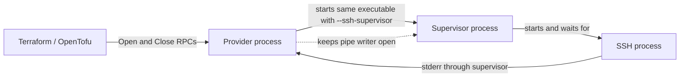

# How the SSH connection provider works

This guide assumes you can read Terraform and have used SSH. You do not need to know Go first. Start with the example
and follow the connection through the code.

## Start with the Terraform example

The neighboring `terraform-provider-sshconnection-test/main.tf` opens a connection like this:

```hcl
ephemeral "sshconnection_connection" "connection" {
    destination = "ankin.info"
    listen {
        bind_address = "127.0.0.1"
        port         = "18080"
        host         = "127.0.0.1"
        host_port    = "80"
    }
}
```

`destination` is the SSH server. The two occurrences of `127.0.0.1` refer to different machines: `bind_address` is on
the computer running Terraform, while
`host` is reached from the SSH server. The result is a local listener on port 18080 that forwards requests to the SSH
server's loopback port 80.

The example's `local_command` data source runs `curl` against port 18080. Its
`depends_on` includes the ephemeral connection. Terraform therefore opens the connection before running the command and
keeps it available while needed. The separate resource named `sleep` currently runs `true`; it does not implement
readiness and no sleep is needed to make the tunnel usable.

Opening succeeds only after SSH has authenticated, created local listeners, and received replies for remote forwarding
requests. That does **not** guarantee an HTTP server is listening behind the tunnel. A failed `curl` can still be an
HTTP or remote-service problem rather than a failed SSH connection.

## Follow the code in this order

| File                                | What to look for                                      |
|-------------------------------------|-------------------------------------------------------|
| `provider/ssh_connection_schema.go` | The Terraform fields and their descriptions.          |
| `connection/model.go`               | Where decoded Terraform values are stored.            |
| `provider/ssh_connection.go`        | `Open`, `Close`, and the table of active connections. |
| `connection/options.go`             | Which SSH options the provider requires, and why.     |
| `connection/cli_args.go`            | How Terraform values become the actual SSH arguments. |
| `connection/cli.go`                 | Starting the supervisor, waiting, and cleaning up.    |
| `connection/readiness.go`           | Recognizing SSH's readiness messages.                 |
| `supervisor/supervisor.go`          | Stopping SSH when the provider goes away.             |
| `../main.go`                        | Choosing provider mode or supervisor mode.            |

The three packages divide work by responsibility. `provider` speaks Terraform;
`connection` manages a running SSH connection; `supervisor` watches its parent. There is one SSH implementation: the
system `ssh` executable on `PATH`.

## The Go notation used here

These are explanations of the constructs you will actually encounter:

- **`type Model struct { ... }`** defines a record with named fields. A tag such as `` `tfsdk:"destination"` `` tells
  Terraform which HCL attribute fills a field.
- **`types.String` rather than `string`** preserves Terraform's three states:
  a known value, null (omitted), and unknown (an expression not resolved yet). Reading `ValueString()` too early would
  turn null/unknown into an empty string.
- **`[]string`** is a list of strings. `append(arguments, "-p", "22")` adds two arguments. `arguments...` passes the
  list's individual elements to a function.
- **`map[string]connection.Connection`** is a dictionary from random tokens to running connections. It is not a list of
  operating-system process IDs.
- **`func (resource *sshConnectionResource) Open(...)`** is a method on a resource. The `*` means it works on the
  existing object, rather than a copy.
  `&value` obtains a pointer to an object so another function can update it.
- **`(Connection, error)`** means a function returns two results: the connection and an error. `nil` means no object or
  no error. `if err != nil` handles failure.
- **`defer`** schedules cleanup for when the function returns, including early returns. Deferred calls run in reverse
  order. In `Open`, the registry unlock therefore happens before a failed connection is closed.
- **`interface`** describes methods an object must provide. Our `Connection`
  interface has only `WaitReady` and `Close`. Tests supply a fake connection to exercise Terraform's lifecycle without
  opening a real SSH session.
- **`go func() { ... }()`** runs work concurrently in a goroutine. Here, one goroutine waits for a process to exit while
  another watches a pipe or waits for readiness. It is ordinary background work, not another operating-system process.
- **`chan struct{}`** is used as a completion signal. `close(signal)` announces completion to everyone waiting on
  `<-signal`. It does not close a connection or kill a process by itself. A channel may only be closed once.
- **`select`** waits for whichever listed event becomes available: cancellation, process exit, or readiness. If multiple
  events are available, order is not guaranteed, which is why readiness checks for process exit again.
- **`sync.Mutex`** prevents simultaneous access to shared mutable data. `Lock`
  acquires that protection and `Unlock` releases it. Do not wait for SSH while holding the connection registry's lock.
- **`sync.Once`** runs a cleanup function exactly once, even if several callers invoke `Close` at the same time. Each
  caller receives the saved cleanup result.
- **`context.Context`** carries cancellation and deadlines. A canceled context does not automatically stop a process;
  the code must observe it and clean up.
- **Diagnostics** are Terraform-facing warnings and errors. Attribute diagnostics include a location such as
  `ssh_option[1].value` so users can find the problem.

## What opens, and who owns it



`Open` decodes and validates the model, creates a random token, starts a connection, waits up to 60 seconds, and stores
the connection under that token. The framework stores the token as a JSON string in private data and returns it in a
later
`Close` request. The historical private key contains `process_id` in its name, but the value is deliberately not a PID.
It is only a lookup key in this provider.

The framework asks a factory for a resource on separate RPCs. The factory returns the same resource object so `Open` and
`Close` share the dictionary. Separate provider instances still have separate dictionaries. A new object on every RPC
would lose the connection before it could be closed.

`StartCLI` launches the same executable with `--ssh-supervisor`. `main.go` handles this argument before starting
Terraform's RPC server. The supervisor launches SSH.

The provider keeps a pipe's **writer** open. The supervisor inherits its **reader**
as standard input. The provider closes its own extra reader after startup. SSH does not inherit this keepalive pipe as
standard input.

Normal `Close` removes the connection from the dictionary, unlocks it, closes the pipe writer, then waits for the
supervisor. The supervisor sees end-of-file, kills SSH, and calls `Wait` to collect its exit status. Only afterward can
cleanup finish and the log file close. Killing and waiting are separate operations.

If the provider crashes or is killed, the OS closes its pipe writer. The supervisor detects the same end-of-file and
stops its SSH child. This is why the supervisor cannot be replaced with an ordinary background goroutine. It is not a
general process-tree manager for arbitrary commands a user supplies via SSH.

Cancellation of `WaitReady` cancels only the wait. The caller still owns the connection. `Open` guarantees cleanup on
every unsuccessful return after startup. Successful registration transfers responsibility to the later `Close` call.
Closing an already-removed token is harmless. Malformed private tokens produce an error rather than selecting an
unrelated connection.

## Arguments and custom options

A representative command for the example is:

```sh
ssh -F none -N \
  -o LogLevel=DEBUG1 \
  -o ExitOnForwardFailure=yes \
  -o ForkAfterAuthentication=no \
  -o ControlMaster=no -o ControlPath=none -o ControlPersist=no \
  -o BatchMode=yes -o ClearAllForwardings=no \
  -a -L 127.0.0.1:18080:127.0.0.1:80 -T -- ankin.info
```

The code passes a list of arguments to `exec.Command`; it does not build and execute this shell string. `--` ends option
parsing before the destination.
`-a` disables authentication-agent *forwarding* to the server; it does not disable using a local agent to authenticate.
`-T` disables terminal allocation.

The source of truth for required options is `requiredOptions` in `options.go`:

| Option                    | Required value | Why                                             |
|---------------------------|----------------|-------------------------------------------------|
| `LogLevel`                | `DEBUG1`       | Readiness depends on debug messages.            |
| `ExitOnForwardFailure`    | `yes`          | Failed forwarding must fail opening.            |
| `ForkAfterAuthentication` | `no`           | SSH must stay owned by the supervisor.          |
| `ControlMaster`           | `no`           | No shared master is created.                    |
| `ControlPath`             | `none`         | No existing master is reused.                   |
| `ControlPersist`          | `no`           | No persistent master survives cleanup.          |
| `BatchMode`               | `yes`          | Terraform cannot answer authentication prompts. |
| `ClearAllForwardings`     | `no`           | Requested forwards must not be erased.          |
| `SessionType`             | `none`         | `-N` disables remote command execution.         |

For each `ssh_option`, validation checks the name and, when known, its value. Names are case-insensitive. A matching
required value is accepted and its redundant argument omitted; a conflicting value is rejected at that block.
`LogLevel=DEBUG`
is accepted as an alias for `DEBUG1`. Every occurrence is checked, including later duplicates. Unrelated options keep
their order and values for OpenSSH to interpret. This preserves repeatable options such as multiple `IdentityFile`
entries.

Validation does not try to reproduce every rule in OpenSSH. Ordinary duplicated settings and overlaps with dedicated
Terraform attributes retain SSH's precedence rules; options that take the first specified value see the dedicated
attributes before custom blocks. Invalid SSH-specific values otherwise fail during startup.

Known errors are reported during Terraform validation. Unknown values may remain while planning, but all supplied values
must be known before launching SSH.

### External SSH configuration is disabled

`-F none` skips both user and system SSH configuration. `config_file` is retained only to give a migration error: omit
it or set it to `none`. `Include`, `Host`, and
`Match` are not accepted as custom options.

Move settings from SSH config into the model. For example, `HostName` can become
`destination`, `User` can become `login_name`, `Port` can become `port`, and
`IdentityFile` can become `identity_file` (or repeatable `ssh_option` blocks). Forwards become `listen` or
`remote_listen` blocks. Do not copy private key contents into Terraform; these attributes take file paths.

Disabling configuration does **not** disable agent use, default key-file discovery, or known-hosts checks. It does
remove custom identity lists and host aliases from SSH config. The live example may need explicit identity paths for
your machine.

OpenSSH passes `-F none` into generated `-J`/`ProxyJump` commands too. Most other command-line settings apply to the
destination, not the jump host. Specify the jump user and port in its destination and use available agent/default
credentials. An explicit `ProxyCommand` is a user-controlled command; the provider does not rewrite it or promise to
suppress config reads inside that command.

## How readiness is detected

The log reader recognizes these OpenSSH messages:

```text
debug1: ssh_init_forwarding: expecting replies for N forwards
debug1: Entering interactive session.
debug1: forwarding_success: all expected forwarding replies received
```

The middle message means OpenSSH has entered its client loop; it does not mean this provider opened an interactive
shell. Local listeners have been created by then. If SSH announced pending replies, readiness also waits for the final
message. The pending announcement happens before the client loop. The code preserves that ordering assumption rather
than trying to count Terraform forwarding blocks.

Writes can split a line anywhere, or contain several lines. `consumeLines` keeps an unfinished line and hands complete
lines to `observeLine`. Both CRLF and LF line endings work. Lines exceeding 16 KiB are discarded until the newline, so a
truncated suffix cannot look like a separate readiness message. A separate 16 KiB tail retains recent diagnostics for
errors. Duplicate messages signal readiness only once.

An unrecognized SSH log format times out rather than reporting false readiness. There is no fixed startup sleep and no
HTTP/TCP probe of services behind the tunnel.

These details were checked against the local `openssh-portable` checkout at commit
`7fe3b24c9`. Relevant functions are `process_config_files`, `ssh_init_forwarding`,
`forwarding_success`, and the jump-command construction in `ssh.c`, and
`client_loop` in `clientloop.c`. See also the upstream
[ssh.c](https://github.com/openssh/openssh-portable/blob/7fe3b24c9/ssh.c),
[clientloop.c](https://github.com/openssh/openssh-portable/blob/7fe3b24c9/clientloop.c),
and [SSH manual](https://man.openbsd.org/ssh). The executable installed on `PATH` may be a different version from this
checkout; the real-client tests are what check the installed version's behavior.

## Logs and failures

Routine SSH output is always captured internally. `quiet` is a compatibility setting with no additional effect; it never
removes debug messages needed for readiness. `log_file` receives an append-only copy written by the provider, rather
than SSH's `-E` option. New files are created with mode 0600; existing permissions are not changed.

If opening the requested log file fails, startup fails before starting SSH. If a later write fails, readiness parsing
and stderr draining continue, the failed copy is not retried, and cleanup reports the first saved write error. Shutdown
always stops SSH before reporting logging errors.

| Event                                           | Result                                                                  |
|-------------------------------------------------|-------------------------------------------------------------------------|
| Invalid provider configuration                  | Diagnostic before process startup.                                      |
| SSH missing or exits during startup             | Opening fails with recent stderr.                                       |
| Occupied local port or rejected remote forward  | SSH exits; opening fails.                                               |
| Unrecognized messages or stalled authentication | Opening times out after at most 60 seconds and cleans up.               |
| Caller cancels during opening                   | Wait returns an error; `Open` closes the connection.                    |
| Provider process exits                          | Pipe closes; supervisor kills and waits for SSH.                        |
| SSH exits after opening succeeded               | The tunnel is lost; there is no automatic reconnect or renewal monitor. |
| Repeated `Close`                                | Cleanup happens once.                                                   |

The 60 seconds bound readiness waiting, not every possible OS operation or cleanup. A shorter caller deadline takes
precedence.

## Tests and making changes

From the provider root:

```sh
go test -race ./...
go vet ./...
go generate ./...
```

The tests use the actual OpenSSH client with a local in-process SSH server, and a built copy of the provider for the
supervisor. No external host or user credentials are required. Other tests exercise configuration, log parsing,
Terraform's RPC boundary, concurrent closes, and a provider process exiting without calling Close. Unix-specific
subprocess tests are build-tagged. The SSH integration tests skip if `ssh` is missing, so check the test output when
validating a new environment.

The neighboring Terraform project is a separate live acceptance check: it requires access to `ankin.info` and an HTTP
service reachable there. Passing isolated tests does not prove those external dependencies are available.

When adding or changing an option:

1. Add its Terraform schema and model field, including the `tfsdk` tag.
2. Add the field to `modelValues` so startup checks unknown values.
3. Add its explicit argument mapping, preserving argument order and null semantics.
4. Decide whether it can interfere with readiness or process ownership; update
   `requiredOptions` and its explanation if needed.
5. Test the user-visible behavior and failure case, not just a helper's output.
6. Update schema descriptions and this guide, then regenerate `docs/`.

Keep lifecycle changes readable as an ordered sequence. Add a helper when it names a distinct piece of work; avoid
introducing a new abstraction merely to shorten a few lines. Comments should explain why a step or ownership rule
exists.
